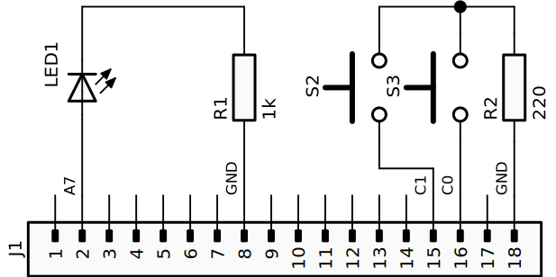

Examples
========

This page contains a few examples.

Speaker
-------

.. literalinclude:: ../../examples/flipperzero_speaker_test.py
   :language: python

Input
-----

.. literalinclude:: ../../examples/flipperzero_draw_on_input_test.py
   :language: python

Tic-Tac-Toe
-----------

.. literalinclude:: ../../examples/tic_tac_toe.py
   :language: python

Interrupts
----------

.. literalinclude:: ../../examples/flipperzero_gpio_interrupt_test.py
   :language: python

This example drives an external LED upon interrupts: A rising edge on ``C0`` sets the pin ``A7`` to high, a rising edge on ``C1`` sets the pin ``A7`` to low.
The following schematic circuit diagram shows the hardware setup for this example:

   Hardware setup for the GPIO interrupt example.

ADC
---

.. literalinclude:: ../../examples/flipperzero_adc_test.py
   :language: python

This example uses a voltage divider with the 3.3 V source from pin 9. The switch ``S1`` changes the input voltage on ``C1`` between 0 and about 0.8 V.

.. figure:: ./assets/adc_circuit.svg
   :width: 90%

   Hardware setup for the ADC example.

PWM
---

.. literalinclude:: ../../examples/flipperzero_pwm_test.py
   :language: python

Infrared
--------

.. literalinclude:: ../../examples/flipperzero_infrared_test.py
   :language: python